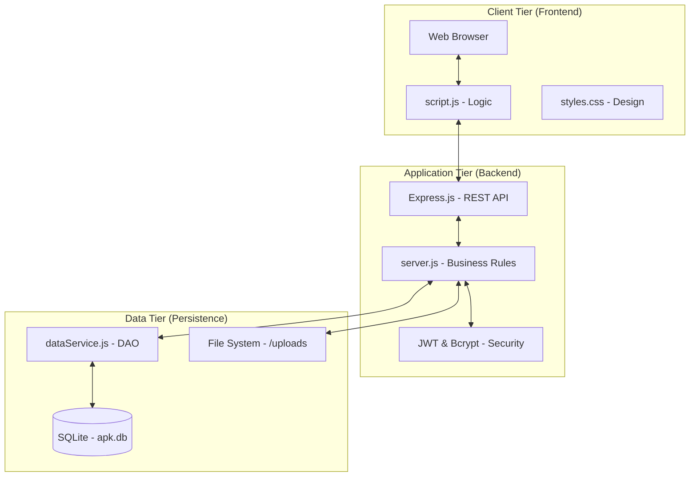

# High-Level Architecture: APK_V2

This document describes the architectural style and components of the Assignment & Portfolio Keeper (APK).

## Architectural Style: Layered Client-Server
The project follows a layered architecture, separating concerns into distinct logical tiers. This choice ensures maintainability and scalability.

### Architecture Diagram

## Description of Layers

### 1. Presentation Layer (Frontend)
- **Tech Stack**: HTML5, CSS3, Vanilla JavaScript.
- **Responsibility**: Rendering the user interface, handling client-side routing (pseudo-SPA), and providing an interactive experience (Clock, Calendar, Glassmorphic effects).
- **Communication**: Interacts with the backend via asynchronous `fetch` requests using JSON.

### 2. Application Layer (Backend)
- **Tech Stack**: Node.js, Express.js.
- **Responsibility**: Handling incoming HTTP requests, managing user sessions via JWT, and enforcing role-based permissions (Teacher vs. Student).
- **Components**:
    - `server.js`: The main entry point and controller.
    - `Middleware`: Handles CORS, file parsing (Multer), and Auth verification.

### 3. Service/Data Layer
- **Responsibility**: Encapsulating data access and storage logic.
- **Components**:
    - `dataService.js`: Acts as a Data Access Object (DAO), providing high-level methods to `server.js`.
    - `SQLite`: Used for storing structured metadata (Users, Classes, Files).
    - `File System`: Stores the physical binary files uploaded by users in the `/uploads` directory.

## Why this Architecture?
1. **Separation of Concerns**: Each layer has a specific job, making it easier to debug and test.
2. **Security**: Sensitive operations (e.g., password hashing, file manipulation) are kept strictly on the server.
3. **Performance**: Offloading UI logic to the client reduces server load.
4. **Reliability**: SQLite provides a robust, zero-configuration relational database perfect for this scale of project.
